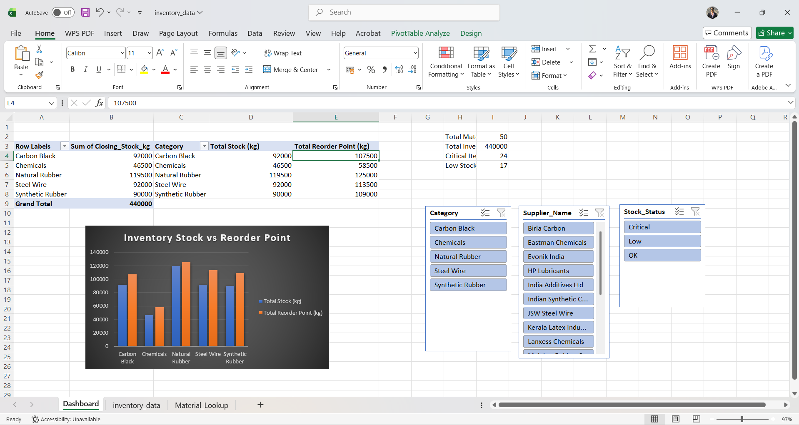
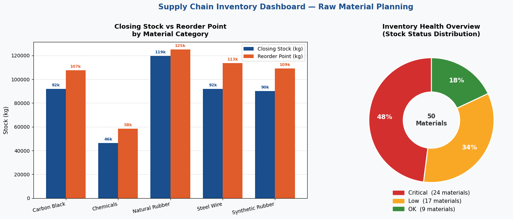

Supply Chain Inventory Dashboard

A professional inventory analytics dashboard developed for a tyre manufacturing company. The project helps monitor inventory levels, identify stock shortages, and support reorder planning using Excel and Python.

Features

* Inventory status classification (Critical, Low, OK)
* Material lookup by Material ID using VLOOKUP
* Category-wise stock analysis with Pivot Tables
* Interactive filtering using Slicers
* KPI tracking for total inventory, critical items, and low-stock materials
* Closing Stock vs Reorder Point visualization
* Data analysis and visualization using Python

Tools & Technologies

* Excel (Pivot Tables, VLOOKUP, Conditional Formatting, Slicers, Charts)
* Python (Pandas, Matplotlib)

Key Insights

* Total Materials: 50
* Total Inventory: 440,000 kg
* Critical Materials: 24
* Low Stock Materials: 17
* Natural Rubber has the highest inventory volume among all categories

Dashboard Preview

Python Analysis Chart

Project Structure

├── inventory_data.csv
├── inventory_analysis.py
├── excel_dashboard.png
├── inventory_analysis_chart.png
└── README.md

Skills Demonstrated

Data Analysis, Inventory Management, Excel Dashboarding, Business Analytics, Data Visualization, Supply Chain Analytics
